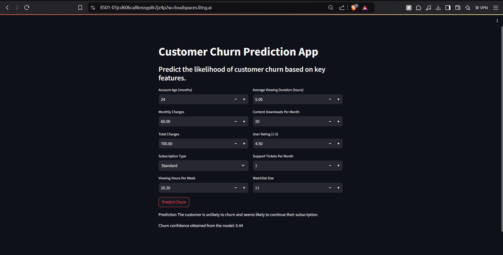

# 📉 Customer Churn Prediction

A production-ready machine learning solution that predicts customer churn for streaming/subscription businesses — built with **LightGBM + SMOTE** and deployed as an interactive **Streamlit** web app.

[](https://python.org)
[](https://lightgbm.readthedocs.io/)
[](https://streamlit.io)
[](https://scikit-learn.org)

---

## 🌐 Live Demo

> Try it yourself: [Google Colab Notebook](https://colab.research.google.com/drive/1wN07WXLO-mUPvVJQV64q-6casNfe3lZv?usp=sharing)

---

## 🖥️ Web Application



*An interactive Streamlit interface — enter a customer's details and get their churn probability in real time.*

---

## 🎯 Problem Statement

Customer churn is one of the most costly problems in subscription businesses. This project builds an end-to-end ML pipeline to **identify at-risk customers before they leave**, giving businesses time to act on retention strategies.

The model takes 10 key customer attributes as input and returns:
- **Churn / No Churn** prediction
- **Churn probability score** (0 to 1)

---

## 📊 Results

The final model — a tuned **LightGBM classifier trained with SMOTE** — achieves the following on the held-out test set (244K records):

| Metric | Score |
|--------|-------|
| **Accuracy** | **90%** |
| **Precision (churn class)** | **98%** |
| **Recall (churn class)** | **82%** |
| **F1 Score** | **89%** |
| **ROC AUC** | **0.9588** |

### Why these numbers matter

- **98% precision** means almost every customer flagged as "at risk" truly is — minimizing wasted retention budget.
- **ROC AUC of 0.959** demonstrates strong discriminative power across all decision thresholds.
- Unlike Random Forest (which overfit to AUC = 1.0 on training data), LightGBM generalizes well — train and test scores are within ~1%.

### Model Comparison

| Model | Train AUC | Test AUC | Overfit? |
|-------|-----------|----------|---------|
| Random Forest + SMOTE | 1.00 | 0.9475 | ✅ Yes |
| LightGBM + SMOTE (base) | 0.9433 | 0.9397 | ❌ No |
| **LightGBM + SMOTE (tuned)** | **0.9588** | **0.9588** | ❌ **No** |

---

## 🔑 Key Concepts

### 1. Feature Engineering
Two custom features were created to boost predictive power:

- **`CustomerTenureEngagement`** — Combines account age with viewing activity to capture long-term loyalty signals.
- **`ContentConsumptionScore`** — Aggregates viewing hours, download frequency, and watchlist size into a single content engagement metric.

These were among the **top features by importance**, outperforming raw individual metrics.

### 2. Handling Class Imbalance with SMOTE
Churn datasets are inherently imbalanced (more loyal customers than churners). **SMOTE (Synthetic Minority Oversampling Technique)** generates synthetic examples of the minority churn class, giving the model balanced exposure during training without simply duplicating records.

### 3. LightGBM
**Light Gradient Boosting Machine** is a tree-based ensemble algorithm optimized for speed and performance on large tabular datasets. Key advantages:
- Leaf-wise tree growth (more accurate than level-wise)
- Native handling of categorical features
- Faster training than XGBoost on large datasets
- Built-in regularization (`reg_alpha`, `reg_lambda`) to prevent overfitting

### 4. Hyperparameter Tuning with GridSearchCV
Optimal parameters found:

```
learning_rate : 0.1
max_depth     : 5 (final pipeline: 20)
n_estimators  : 700 (final pipeline: 900)
num_leaves    : 20
reg_alpha     : 0.1
reg_lambda    : 0.1
```

Tuning was optimized for **F1 score** to balance precision and recall on the churn class.

### 5. Preprocessing Pipeline
A `sklearn` Pipeline encapsulates:
- **Ordinal encoding** for `SubscriptionType` (Basic < Standard < Premium)
- **One-hot encoding** for other categorical features
- **Robust Normalization** — chosen over MinMax/Standard scaling because it uses median and IQR, making it resilient to outliers
- **Winsorization & log transforms** to reduce feature skewness

The pipeline is serialized as `preprocessing_pipeline.pkl`, ensuring the app applies the exact same transformations at inference time.

---

## 📁 Project Structure

```
customer-churn-prediction/
│
├── Customer_Churn_Prediction.ipynb   # Full ML workflow notebook
├── app.py                            # Streamlit web application
├── smote_lgbm.pkl                    # Trained LightGBM model
├── preprocessing_pipeline.pkl        # Fitted preprocessing pipeline
├── requirements.txt                  # Python dependencies
└── WebUI.png                         # App screenshot
```

---

## 🚀 Getting Started

### Step 1 — Clone the repository

```bash
git clone https://github.com/your-username/customer-churn-prediction.git
cd customer-churn-prediction
```

### Step 2 — Set up a virtual environment

```bash
python -m venv venv
source venv/bin/activate        # macOS / Linux
venv\Scripts\activate           # Windows
```

### Step 3 — Install dependencies

```bash
pip install -r requirements.txt
```

### Step 4 — Run the Streamlit app

```bash
streamlit run app.py
```

The app will open in your browser. Enter customer details and click **Predict Churn**.

---

## 📥 Input Features

| Feature | Description |
|---------|-------------|
| `AccountAge` | How long the customer has been subscribed (months) |
| `MonthlyCharges` | Current monthly bill |
| `TotalCharges` | Cumulative charges over account lifetime |
| `SubscriptionType` | Basic / Standard / Premium |
| `ViewingHoursPerWeek` | Average weekly content consumption |
| `AverageViewingDuration` | Mean session length (hours) |
| `ContentDownloadsPerMonth` | Offline downloads per month |
| `UserRating` | Customer satisfaction rating (1–5) |
| `SupportTicketsPerMonth` | Volume of support interactions |
| `WatchlistSize` | Number of titles saved to watchlist |

---

## 📦 Dataset

**Source:** [Kaggle — Predictive Analytics for Customer Churn](https://www.kaggle.com/datasets/safrin03/predictive-analytics-for-customer-churn-dataset)

- Training set: **243,787 records**, 21 features
- Test set: **~112K records**

---

## 🛠️ Tech Stack

- **Python 3.10**
- **LightGBM 4.5** — gradient boosting model
- **imbalanced-learn 0.12** — SMOTE oversampling
- **scikit-learn 1.3** — preprocessing pipeline, GridSearchCV
- **Streamlit 1.27** — web app deployment
- **pandas / NumPy / matplotlib** — data processing and visualization

---

## 🤝 Acknowledgements

EDA approach referenced from [Shravani's EDA](https://www.kaggle.com/) on the same dataset. Dataset provided by [Safrin03 on Kaggle](https://www.kaggle.com/datasets/safrin03/predictive-analytics-for-customer-churn-dataset).
